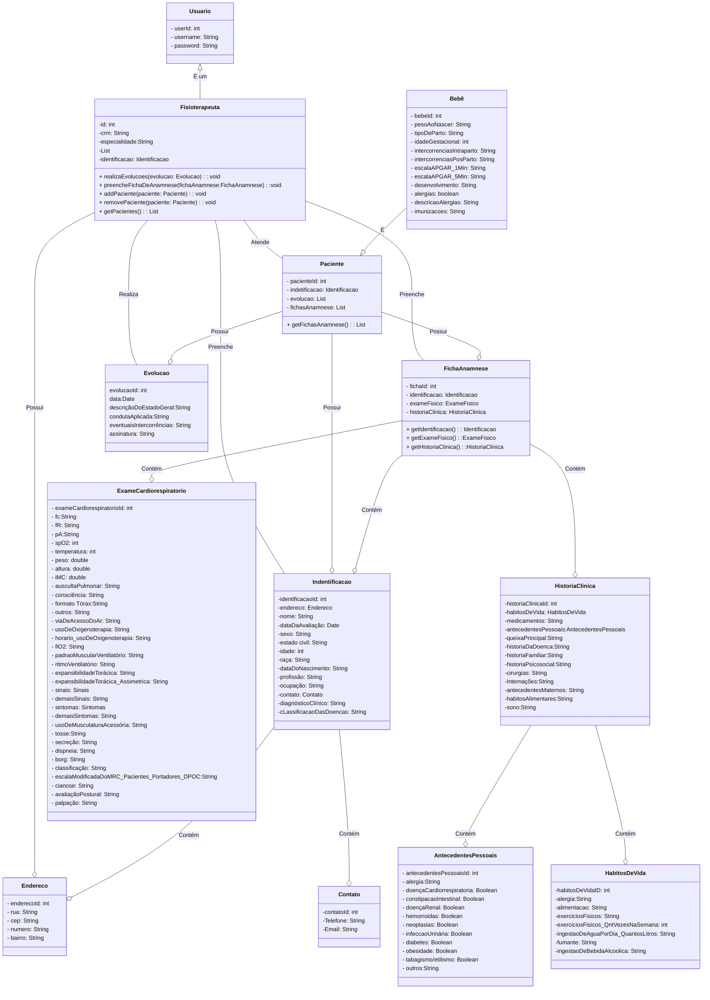

# Fisio App

## Descrição
O Fisio App é um projeto desenvolvido para fisioterapeutas facilitarem o gerenciamento de atendimentos aos seus pacientes. O sistema permite o cadastro de usuários, pacientes, preenchimento de fichas de anamnese e registro de evoluções.

## Tecnologias Utilizadas
- **Frontend:** Vue.js
- **Backend:** GraphQL
- **Banco de Dados:** MySQL

## Instalação

### Pré-requisitos
Certifique-se de ter o Node.js e o npm instalados em sua máquina.

### Backend
1. Navegue até o diretório `backend/`.
2. Execute `npm install` para instalar as dependências.
3. Configure as informações do banco de dados no arquivo `.env`.
4. Execute `npm start` para iniciar o servidor GraphQL.

### Frontend
1. Navegue até o diretório `frontend/`.
2. Execute `npm install` para instalar as dependências.
3. Execute `npm run serve` para iniciar o servidor de desenvolvimento Vue.js.

## Funcionalidades

### Cadastro de Usuários
- Registre fisioterapeutas e equipe administrativa.

### Cadastro de Pacientes
- Adicione informações detalhadas sobre os pacientes.

### Ficha de Anamnese
- Preencha fichas de anamnese para registrar histórico médico e informações relevantes.

### Registro de Evoluções
- Acompanhe o progresso dos pacientes por meio de registros de evoluções.

## Contribuição
Contribuições são bem-vindas! Sinta-se à vontade para abrir issues ou pull requests.

## Licença
Este projeto está licenciado sob a [MIT License](LICENSE).
# Diagrama de classe 

